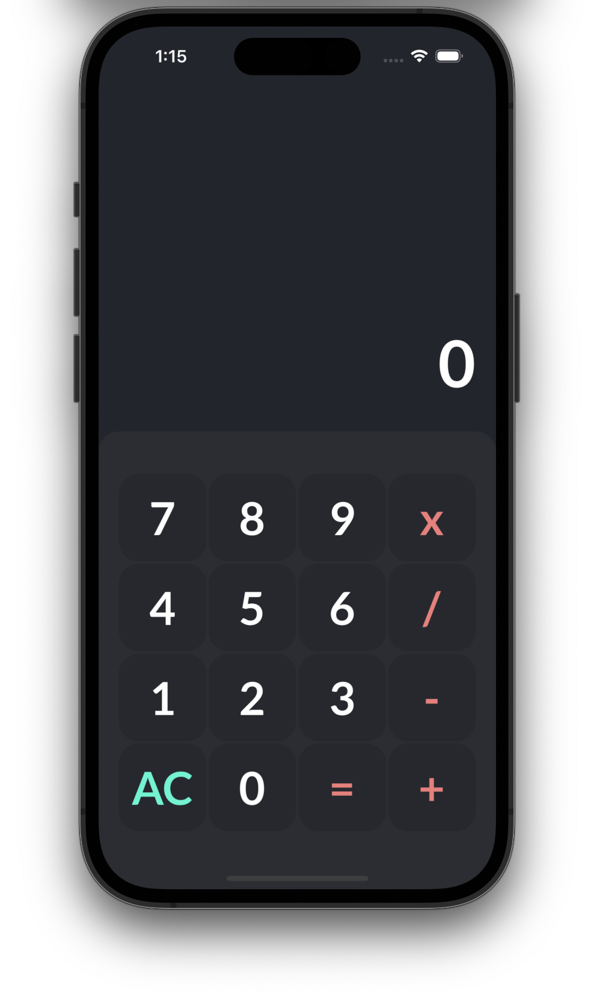

# iOS Calculator App

## Overview

This iOS calculator application provides basic arithmetic operations such as addition, subtraction, multiplication, and division. It is designed with a user-friendly interface for easy usability. 

This project is a hobby project developed with designing done on Figma.

## Screenshots

## Features

- **Basic Arithmetic Operations:** Perform addition, subtraction, multiplication, and division.
- **Clear Button:** Clear the input and start a new calculation.
- **Error Handling:** Display error messages for invalid operations such as division by zero.
- **Responsive Design:** Adapted for various screen sizes, including iPhones and iPads.

## Getting started

You'll need a working MacOS development environment with XCode 10 to use this app. You can find instructions to get up and running on the Apple [XCode website](https://developer.apple.com/xcode/).

## Usage

1. Launch the application on your iOS device.
2. Use the buttons to input numbers and perform calculations.
3. Tap "=" to see the result.
4. Tap "AC" to clear the input.

## Testing

The application includes XCTestCases to ensure the correctness of calculations. To run the tests, navigate to the CalculatorTests directory and run the test.

## Contributing

Contributions are welcome! If you find any issues or have suggestions for improvements, please open an issue or create a pull request.
